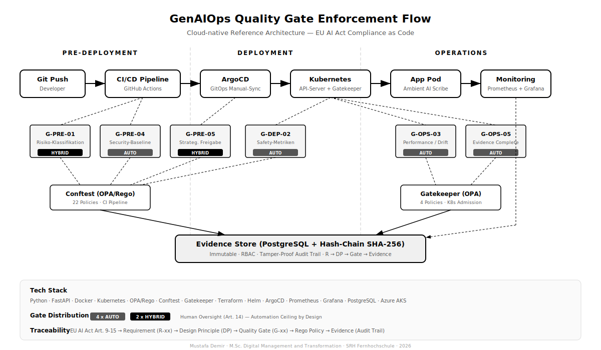
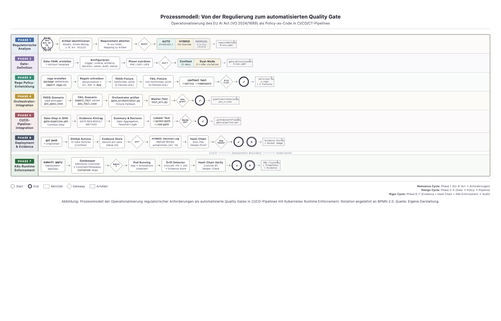

# GenAIOps Compliance Gates — EU AI Act Compliant Quality Gate System

A cloud-native reference architecture for operationalizing regulatory, technical, and strategic requirements in GenAI systems through automated Quality Gates — with full EU AI Act (Regulation 2024/1689) compliance built into CI/CD/CT pipelines.

[](https://creativecommons.org/licenses/by-nc/4.0/)

---

## What This Is

Enterprise GenAI systems face a triple challenge: they must be **technically robust**, **strategically governed**, and **regulatorily compliant** — simultaneously and continuously. This reference architecture solves that by embedding 16 automated Quality Gates across the entire GenAI lifecycle, enforced through Policy-as-Code.

**Key idea:** Compliance is not a document you write after deployment. It's a property the system enforces at every pipeline stage.

### Core Capabilities

- **16 Quality Gates** across 3 lifecycle phases (Pre-Deployment, Deployment, Operations)
- **Policy-as-Code** via OPA/Rego with three enforcement pillars (Conftest, Gatekeeper, Decision Logs)
- **10 implemented Rego Policies** covering Art. 9, 10, 11, 13, 14, 15, 26.5 + Annex IV
- **Immutable Evidence Store** with SHA-256 hash-chain for audit-proof traceability
- **Full EU AI Act mapping**: Art. 9–15 → Requirements → Gates → Policies → Evidence
- **Automated gate decisions** using the CDV Framework (Contract → Validation → Severity → Pipeline-Decision)
- **Post-Market Surveillance** with drift detection and incident reporting (Art. 72, Art. 26.5)

## Architecture Overview

### Five-Pillar Model

| Pillar | Component | Purpose |
|--------|-----------|---------|
| **S1** | Design Principles (DP1–DP5) | Architectural foundation and cloud-native integrability |
| **S2** | Quality Gate Control System | 16 lifecycle-integrated gates with 7-attribute template |
| **S3** | Policy Engine | OPA/Rego policies, Conftest (CI), Gatekeeper (K8s admission), Decision Logs |
| **S4** | Evidence Store | PostgreSQL + Blob Storage, hash-chain integrity, RBAC, schema separation |
| **S5** | Monitoring & PMS | Drift detection (PSI/Jensen-Shannon), incident reporting, sidecar pattern |

### Design Principles

| ID | Principle | EU AI Act Anchor |
|----|-----------|-----------------|
| DP1 | Compliance as controllable lifecycle process | Art. 9 (Risk Management) |
| DP2 | End-to-end traceability chain | Art. 11 (Technical Documentation) |
| DP3 | Gate template as standardization unit | Art. 11 + Annex IV |
| DP4 | Separation of governance dimensions, integrated decision | Art. 14 (Human Oversight) |
| DP5 | Cloud-native integrability | Art. 15 (Robustness) |

### Automation Classification

The architecture achieves a **10:6:0 distribution** — 10 fully automated gates (62.5%), 6 hybrid gates (37.5%), 0 manual-only gates. A dedicated **D3×D2 Override Rule** ensures that gates requiring First-Degree Human Oversight (EU AI Act Art. 14, operationalized following Laux 2024, S. 2857) are capped at HYBRID automation, regardless of technical feasibility.

```
Gate Inclusion Rule: D1 (Gate-Eignung) → D3 (Regulatory) → D2 (Technical) → Classification
                     ↓
                     D3=FIRST-DEGREE → D2 max HYBRID (Automation Ceiling)
```

### Enforcement Flow



### Process Model: From Regulation to Automated Quality Gate



*7-phase operationalization process: EU AI Act (Art. 9–15) → Requirements → Gate Definition → Rego Policy → Orchestrator → CI/CD Pipeline → Evidence Store → K8s Runtime Enforcement. BPMN 2.0 notation.*

## Repository Structure

```
genaiops-compliance-gates/
├── README.md
├── docs/
│   ├── architecture/           # Architecture diagrams (Five-Pillar, Gate Flow, Pipeline)
│   └── walkthrough/            # PoC walkthrough documentation with screenshots
├── gate-definitions/           # Quality Gate specifications (YAML)
│   ├── gate_template.yaml      # 7-attribute gate template
│   ├── pre-deployment/         # G-PRE-01 to G-PRE-05
│   ├── deployment/             # G-DEP-01 to G-DEP-06
│   └── operations/             # G-OPS-01 to G-OPS-05
├── policies/                   # OPA/Rego policy implementations
│   ├── pre-deployment/         # Conftest policies (CI stage)
│   ├── deployment/             # Conftest + Gatekeeper policies
│   └── operations/             # Gatekeeper admission policies
├── pipeline/
│   └── .github/workflows/      # GitHub Actions with gate-integrated stages
├── evidence-store/
│   ├── schema/                 # PostgreSQL DDL (v01 basic, v02 enterprise)
│   └── migrations/             # Schema migration scripts
├── monitoring/                 # Drift detection, PMS, sidecar configuration
├── infrastructure/
│   ├── terraform/              # Azure AKS, PostgreSQL, Blob Storage provisioning
│   └── helm/                   # Kubernetes deployments (OPA Gatekeeper, app, monitoring)
├── scenarios/
│   └── healthcare-ambient-ai-scribe/  # PoC scenario: High-risk AI (Art. 6 (1) + Annex I No. 11 MDR)
└── requirements/               # R001–R014 requirement specifications (from EU AI Act)
```

## Tech Stack

| Layer | Technology | Purpose |
|-------|-----------|---------|
| **Orchestration** | Kubernetes (AKS) | Container orchestration, admission control |
| **GitOps** | ArgoCD | Declarative deployments, drift reconciliation |
| **Policy Engine** | OPA/Rego, Conftest, Gatekeeper | Policy-as-Code evaluation at CI + admission |
| **CI/CD** | GitHub Actions | Pipeline orchestration with gate stages |
| **Evidence Store** | Azure PostgreSQL + Blob Storage | Structured metadata + unstructured artifacts |
| **Monitoring** | Prometheus, Grafana, OpenTelemetry | Metrics, drift detection, alerting |
| **IaC** | Terraform, Helm | Infrastructure provisioning + app deployment |
| **GenAI Runtime** | Azure OpenAI Service, LangChain | LLM inference, RAG pipeline |

## Quality Gate Framework

Each of the 16 gates follows a standardized 7-attribute template:

```yaml
gate_id: G-PRE-01
name: Risk Classification & Impact Assessment
trigger: Model registration or risk-level change
governance_dimension: regulatory
check_criteria:
  - EU AI Act risk classification completed
  - Risk mitigation measures documented
evidence_artifacts:
  - risk_classification_report
  - impact_assessment_document
decision_logic: CDV (Contract → Validation → Severity → Pipeline-Decision)
responsibility: AI Governance Lead + Risk Officer
audit_trail: Immutable evidence record with SHA-256 hash
waiver_policy: Requires C-level approval with time-bound remediation plan
```

### Gate Distribution

| Phase | Gates | Automation |
|-------|-------|-----------|
| **Pre-Deployment** | G-PRE-01 to G-PRE-05 | 3 AUTO, 2 HYBRID (G-PRE-01 + G-PRE-05 = HYBRID fuer First-Degree-Oversight) |
| **Deployment** | G-DEP-01 to G-DEP-06 | 4 AUTO, 2 HYBRID |
| **Operations** | G-OPS-01 to G-OPS-05 | 3 AUTO, 2 HYBRID |
| **Summe** | **16 Gates** | **10 AUTO, 6 HYBRID, 0 MANUAL** |

## PoC Scenario: Healthcare Ambient AI Scribe

The architecture is demonstrated using a **high-risk AI system** (EU AI Act Art. 6 (1) in conjunction with Annex I No. 11 — safety component of a Clinical Decision Support System classified as a medical device under MDR 2017/745): an Ambient AI Scribe that transcribes and summarizes medical consultations.

**Why this scenario:**
- High-risk classification → maximum regulatory requirements
- Sensitive health data → GDPR Art. 9 + AI Act convergence
- Stochastic outputs → quality assurance for generative content
- Full lifecycle coverage → 16 gates designed, 10 with Rego policies (local + CI), 4 enforced in GitHub Actions

## Traceability Chain

Every regulatory requirement is traceable from norm to evidence:

```
EU AI Act Article → Requirement (R-xx) → Design Principle (DP) → Quality Gate (G-xx) → Policy (Rego) → Evidence (Audit Trail)
```

This six-level traceability chain ensures that for any audit finding, the path back to the originating regulation is documented and verifiable.

## Getting Started

> ⚠️ **Work in Progress** — The architecture is being implemented incrementally. See the build status below.

### Prerequisites

- Azure subscription with AKS enabled
- Terraform >= 1.5
- Helm >= 3.12
- OPA/Conftest CLI
- kubectl configured for AKS cluster

### Quick Start

```bash
# 1. Provision infrastructure
cd infrastructure/terraform
terraform init && terraform apply

# 2. Deploy OPA Gatekeeper
cd ../helm
helm install gatekeeper gatekeeper/gatekeeper --namespace gatekeeper-system

# 3. Apply policies
cd ../../policies
conftest test --policy pre-deployment/ scenarios/healthcare-ambient-ai-scribe/

# 4. Initialize Evidence Store
cd ../evidence-store
psql -f schema/evidence_store_schema_v02_enterprise.sql

# 5. Run pipeline with gates
# (see pipeline/.github/workflows/ for CI/CD integration)
```

## Implementierungsfortschritt

> Strategie: Lokal-first (Phase 1–11 kostenlos auf Minikube), Azure erst Phase 12. Geschaetzter Aufwand: ~30–42h ueber 4–6 Wochen.

<!-- PROGRESS-START -->
> Gesamtfortschritt: `████████████████████` **100%** (12/12 Phasen)

| Phase | Beschreibung | Fortschritt | Status |
|-------|-------------|------------|--------|
| **1** | App entwickeln (FastAPI + Mock-Endpoint) | `████████████████████` 100% | done |
| **2** | Containerisieren (Dockerfile, Multi-Stage, Non-Root) | `████████████████████` 100% | done |
| **3** | Docker Compose (App + DB + Prometheus + Grafana) | `████████████████████` 100% | done |
| **4** | K8s-Manifeste (Deployment, Service, ConfigMap, Compliance-Annotations) | `████████████████████` 100% | done |
| **5** | Rego-Policies + Conftest-Tests (10 Gates) | `████████████████████` 100% | done |
| **6** | Lokaler Cluster (Minikube) + Helm + Gatekeeper | `████████████████████` 100% | done |
| **7** | Gatekeeper ConstraintTemplates (ADMIT/REJECT live) | `████████████████████` 100% | done |
| **8** | Evidence Store + Closed-Loop Pipeline | `████████████████████` 100% | done |
| **9** | Drift Detection (PSI/JSD + Prometheus + Grafana) | `████████████████████` 100% | done |
| **10** | GitHub Actions Pipeline (Conftest CI + Evidence) | `████████████████████` 100% | done |
| **11** | Green/Red Path Walkthrough + Screenshots (Kap. 6.3) | `████████████████████` 100% | done |
| **12** | Azure AKS Migration (Sweden Central, LoadBalancer 74.241.179.251) | `████████████████████` 100% | done |
<!-- PROGRESS-END -->

### Artefakt-Status

| Komponente | Status | Details |
|-----------|--------|--------|
| Requirements (R001–R014) | done | 14 YAML-Specs, EU AI Act Art. 9–15 Mapping |
| Evidence Store Schema | done | v01 (basic) + v02 (enterprise) + v03 (decision_method, E13) |
| Evidence Store Scripts | done | record_evidence.py + verify_hash_chain.py, SQLite + PostgreSQL, Hash-Chain verified |
| Decision-Log-Fixtures | done | G-PRE-01 (manual_review) + G-PRE-05 (governance_approval), HYBRID-Demo ready |
| Gate Template | done | 7-Attribut-Template, 3 Beispiel-Gates |
| Policy-Kandidaten | done | 29 Kandidaten dokumentiert (22 Conftest, 4 Gatekeeper, 3 Decision Logs) |
| Healthcare Scribe App | done | FastAPI Mock-Endpoint, /transcribe, /health, /metrics |
| Gate-Fixtures | done | app_documentation.json, eval_results.json |
| K8s-Manifeste | done | 8 YAMLs: Namespace, Deployment, Service, ConfigMap, PostgreSQL, Prometheus |
| OPA/Rego-Code | done | 10 Policies (5 Conftest PRE + 2 Conftest DEP + 3 Gatekeeper OPS), ~100 Regeln, 21 Fixtures |
| Integration Tests | done | 8 Tests (HYBRID E2E, Tamper Detection, Chain Linkage, Non-Blocking Semantics) |
| Tamper-Detection Spec | done | Dokumentiert: 8 erkannte Angriffsvektoren, 6 bekannte Limitationen, 3 Protection Layers |
| Walkthrough-Dokumentation | done | 13-Schritte Walkthrough für Kap. 6.3 (Pre-Dep → Dep → Ops → HYBRID → Tamper) |
| Schema-Evolution-Dok | done | v01→v02→v03 Changelog mit Rationale und Hash-Trigger-Details |
| Minikube Deployment Scripts | done | 4 scripts: setup-minikube, install-gatekeeper, deploy-app, smoke-test (8/8 PASS) |
| Helm Values | done | gatekeeper-values.yaml + prometheus-stack-values.yaml |
| Gatekeeper Live | done | 2 CTs + 2 Constraints, ADMIT/REJECT verified on cluster |
| Closed-Loop Pipeline | done | gate_orchestrator.py: 3 scenarios (PASS/FAIL/Gatekeeper), tamper detection |
| Drift Detection | done | drift_detector.py (PSI+JSD), CronJob + Prometheus/Grafana/AlertManager |
| GitHub Actions Pipeline | done | gate-pipeline.yml (10 CI gates + Evidence + Hash-Chain + Docker Push), test_pipeline_local.sh |
| Master Integration Test | done | test_all.py: 22/22 PASS across all 5 pillars |
| Integrity Regression Suite | done | test_integrity_regression.py: credibility checks for fallbacks, evidence strictness, HYBRID consistency, walkthrough drift |
| Kolloquium Documentation | done | CLOSED_LOOP_ERKLAERUNG.md: Phase 8–10 with Q&A |
| Terraform/Helm (Azure) | done | AKS Sweden Central live 2026-04-13 (kube-prometheus-stack via Helm, OPA Gatekeeper mit 3 ConstraintTemplates runtime, PostgreSQL + Hash-Chain-Triggern im Cluster-Pod) |

## Integrity Regression Suite

The repository includes a dedicated integrity-focused regression suite in addition to the functional master test.

```bash
python3 test_integrity_regression.py
python3 test_integrity_regression.py --format json
python3 test_integrity_regression.py --fail-on low
```

This suite is intended to catch PoC-credibility risks such as:

- demo fallbacks that can mask missing enforcement
- non-critical treatment of Evidence Store or hash-chain failures
- HYBRID gate inconsistencies across scripts and scenarios
- walkthrough/documentation drift against current repo files

## Academic Foundation

This implementation is the technical instantiation of a Design Science Research (DSR) artifact developed as part of a master's thesis:

> **Demir, M. (2026).** *Cloud-native Referenzarchitektur für GenAIOps mit Quality-Gate-Kontrollsystem zur lifecycle-integrierten Operationalisierung normativer Anforderungen — auf Basis des EU AI Act.* M.Sc. Thesis, SRH Fernhochschule. [Thesis Repository →](https://github.com/MustDemir/Masterarbeit-GenAIOps-Referenzarchitektur)

The thesis provides the full academic rationale including: DSR methodology (Hevner/Peffers), requirements derivation from EU AI Act, convergence analysis with NIST AI RMF, and expert evaluation.

## License

This work is licensed under [CC BY-NC 4.0](https://creativecommons.org/licenses/by-nc/4.0/). You may share and adapt for non-commercial purposes with attribution.

## Author

**Mustafa Demir** — AI & Cloud Solution Architect

[](https://mustafa-demir.com)
[](https://www.linkedin.com/in/mustafa-demir-331900202/)
[](https://github.com/MustDemir)
