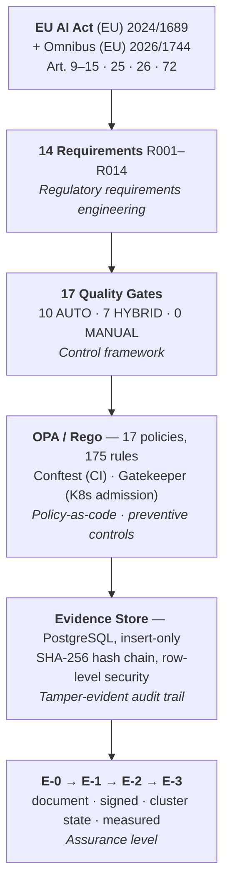
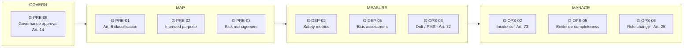
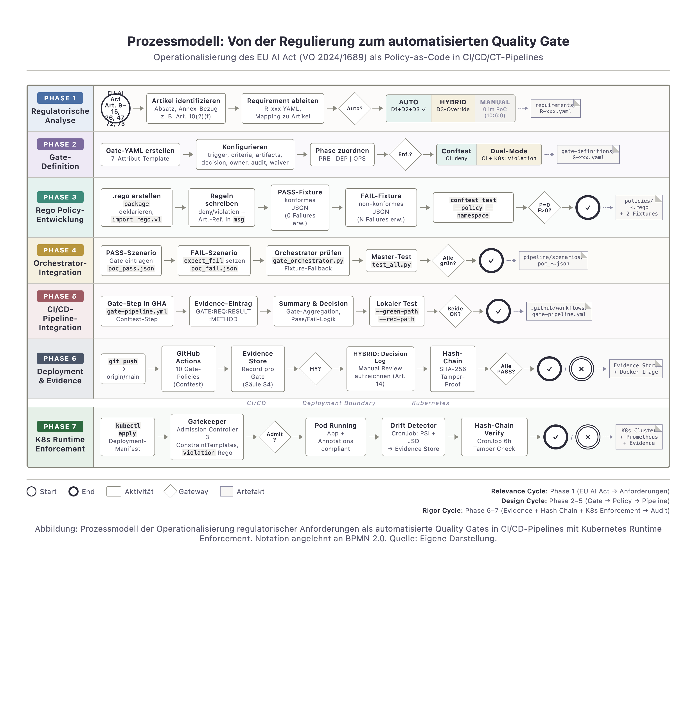

# GenAIOps Compliance Gates

**Regulatory obligations, enforced as code in the delivery pipeline — and evidenced in a tamper-evident audit trail.**

A cloud-native reference architecture that turns EU AI Act obligations into automated quality gates in CI/CD, and records every gate decision as verifiable evidence. Built as a Design Science Research artefact, developed beyond it towards production readiness.

[](https://www.apache.org/licenses/LICENSE-2.0)
[](https://github.com/MustDemir/genaiops-compliance-gates/actions)
[](CHANGELOG.md)
[](https://doi.org/10.5281/zenodo.19920310)

---

## At a glance

|  |  |
|---|---|
| **Discipline** | AI Governance · AI Assurance · AI Risk Management · Compliance-as-Code |
| **Regulation** | EU AI Act (EU) 2024/1689 as amended by (EU) 2026/1744 · NIS2 · EnWG § 11 |
| **Standards context** | ISO/IEC 42001 (AI management system) · ISO/IEC 23894 (AI risk management) · NIST AI RMF · ISO/IEC 27001/27019 |
| **Technology** | OPA/Rego · Conftest · OPA Gatekeeper · Kubernetes · GitHub Actions · PostgreSQL · Prometheus · Python |
| **The idea** | Compliance is not a document written after deployment. It is a property the pipeline enforces, and the evidence store proves. |
| **Goal** | Business-ready, not proof-of-concept: what is enforced, what is only declared, and how strong the evidence is are stated explicitly rather than implied. |

## How it works


```mermaid
flowchart TB
    A["<b>EU AI Act</b> (EU) 2024/1689<br/>+ Omnibus (EU) 2026/1744<br/>Art. 9–15 · 25 · 26 · 72"]
    B["<b>14 Requirements</b> R001–R014<br/><i>Regulatory requirements engineering</i>"]
    C["<b>17 Quality Gates</b><br/>10 AUTO · 7 HYBRID · 0 MANUAL<br/><i>Control framework</i>"]
    D["<b>OPA / Rego</b> — 17 policies, 175 rules<br/>Conftest (CI) · Gatekeeper (K8s admission)<br/><i>Policy-as-code · preventive controls</i>"]
    E["<b>Evidence Store</b> — PostgreSQL, insert-only<br/>SHA-256 hash chain, row-level security<br/><i>Tamper-evident audit trail</i>"]
    F["<b>E-0 → E-1 → E-2 → E-3</b><br/>document · signed · cluster state · measured<br/><i>Assurance level</i>"]
    A --> B --> C --> D --> E --> F
```

Each arrow is a traceable link. For any finding in the evidence store, the path back to the originating article of the regulation is documented and machine-readable.

## What makes this different

Most AI governance tooling answers *"is there a policy?"*. This answers *"can you prove it, and how hard would the proof be to fake?"*

- **Evidentiary strength as a second axis.** Automatability (AUTO/HYBRID/MANUAL) says how much runs without a human. It says nothing about how hard the evidence is to forge. Every check therefore also declares an **assurance level E-0 … E-3**. A pod annotation is E-0 — it *asserts* a state, it does not *prove* one.
- **Provider and deployer obligations are separated.** *The provider owes the properties of the system; the deployer owes the properties of its use.* Art. 16(a) is the hinge, and the market gets this wrong routinely.
- **Nothing is claimed that is not enforced.** 40 of 47 checks are implemented, 7 are design-only — and each check states which it is. The integrity suite fails the build if a declaration and reality drift apart.
- **There is no exception path.** The waiver mechanism was abolished rather than left as an unimplemented promise, because an exception that leaves no trace devalues the completeness of the chain.

## Status

| | |
|---|---|
| Gates / requirements | 17 gates · 14 requirements · 47 checks (40 enforced, 7 design-only) |
| Policies | 17 Rego policies · 175 deny/warn/violation rules |
| Tests | 187 Rego unit tests · 35 integration tests · 24 integrity checks · hash-chain verification per run |
| Evidence schema | v06 (`ai_act_role`, `derived_decision`, `runtime_mode` sealed into the payload) |
| Deployment verified | Local (Minikube, Docker) and Azure AKS, Sweden Central |

> **Reproducibility.** The exact state cited in the graded Master's thesis — 14 requirements, 16 gates, 10 AUTO / 6 HYBRID / 0 MANUAL, 108 rules, 141 unit tests — is frozen under the tag `thesis-v1.0` and archived under the Zenodo DOI above. Everything since is post-thesis development and reports different counts; see [CHANGELOG.md](CHANGELOG.md).

## Open points

Carried deliberately rather than silently. This section is part of the artefact, not an afterthought: a control system that hides its own gaps fails its own premise.

- **Provider requirements are not derived yet.** Art. 16(a)–(l) with Art. 17–20, 43, 47, 48, 49(1) is the largest open block; `AI_ACT_ROLE=PROVIDER` matches no gate today.
- **7 of 47 checks are design-only.** They sit in G-PRE-04, G-DEP-01 and G-DEP-03, which therefore report PASS while part of what they declare has not been evaluated. Each check states this itself, and the integrity suite verifies the claim in both directions at HIGH severity.
- **`evidence_level.current` is E-0 on every gate.** Raising gates to E-1 requires signed CI attestations (`cosign`, keyless via OIDC); E-2 requires Gatekeeper `data.inventory` against a live cluster. Per-check levels are being filled in as the wiring lands — 10 of 47 checks carry one today.
- **Accuracy is not measurable in operation.** Without ground truth there are only proxies. The evaluation document declares `provenance: "declared"` for those figures rather than presenting them as measurements. Coupling human oversight under Art. 14 to post-market monitoring under Art. 72 — the reviewer's correction *is* the label — is designed but not built.
- **The Art. 6(1a)/(1b) reading is a hypothesis.** No guidelines, no case law. Marked as such in the policy header.
- **G-DEP-01 references Art. 10 and Art. 11 while being deployer-scoped.** Both are provider duties, and Annex IV documentation is owed to authorities, not to the deployer. The deployer-side anchor is Art. 26(4). Left unchanged because the correction also moves the R002 mapping and belongs with the provider derivation.
- **The role is a property of the pipeline run, not of the system.** Whether it should be tracked per system or per system version is undecided; the current design makes the simplest choice and defers the question.
- **The drift CronJob is not deployable as shipped.** It now requires `conftest` and the policy directory inside its image, and no Dockerfile for that image exists here. It exits with an error rather than falling back to a non-policy verdict.
- **Versioning and release tagging are unresolved.** `thesis-v1.0` points at a *later* commit than the `v2.0.0` and `v1.1.0` tags, while `CITATION.cff` declares `version: 2.0.0` with three DOIs. New release tags and Zenodo pushes are on hold until this is settled; ordinary development is unaffected.

---

## What this is, in the field's own terms

The repository speaks in gate ids and schema fields. The same substance carries these names in the AI governance and assurance market:

| In this repository | English term | Deutscher Begriff |
|---|---|---|
| 17 quality gates in CI/CD | Compliance-as-code · continuous compliance · control automation | Kontrollautomatisierung |
| Rego policies, Conftest, Gatekeeper | Policy-as-code · preventive controls · admission control | Präventive Kontrollen |
| Evidence Store + hash chain | Auditability · tamper-evident audit trail · evidence management | Revisionssichere Nachweisführung |
| `evidence_level` E-0 … E-3 | Assurance level · evidence assurance | Nachweisgüte, Prüftiefe |
| R001–R014 derived from Art. 9–15 | Regulatory requirements engineering · control mapping · crosswalk | Anforderungsableitung |
| `role_scope` PROVIDER / DEPLOYER | Obligation mapping · role determination | Rollenabgrenzung, Pflichtenzuordnung |
| G-PRE-01 Art. 6 decision tree | AI risk classification | Risikoeinstufung |
| `requirements/` + `gate-definitions/` | AI system inventory / AI register | KI-Register |
| G-DEP-04 | Conformity assessment intake | Konformitätsbewertung |
| Drift detector (PSI / Jensen-Shannon) | Post-market monitoring (Art. 72) · model monitoring | Beobachtung nach Inverkehrbringen |
| Integrity regression suite | Continuous control monitoring · control effectiveness testing | Wirksamkeitsprüfung |
| Abolished waiver path | Exception management | Ausnahmeverwaltung |
| `specs/` + CHANGELOG | Change and configuration management | Änderungsmanagement |
| Supplier evidence (planned) | Third-party AI risk · supply chain assurance · AIBOM | Lieferantenprüfung |

### Framework placement

The gates map onto the four core functions of the **NIST AI RMF** (Tabassi 2023):


```mermaid
flowchart LR
    subgraph GOVERN
      G1["G-PRE-05<br/>Governance approval<br/>Art. 14"]
    end
    subgraph MAP
      M1["G-PRE-01<br/>Art. 6 classification"]
      M2["G-PRE-02<br/>Intended purpose"]
      M3["G-PRE-03<br/>Risk management"]
    end
    subgraph MEASURE
      S1["G-DEP-02<br/>Safety metrics"]
      S2["G-DEP-05<br/>Bias assessment"]
      S3["G-OPS-03<br/>Drift / PMS · Art. 72"]
    end
    subgraph MANAGE
      N1["G-OPS-02<br/>Incidents · Art. 73"]
      N2["G-OPS-05<br/>Evidence completeness"]
      N3["G-OPS-06<br/>Role change · Art. 25"]
    end
    GOVERN --> MAP --> MEASURE --> MANAGE
```

**On ISO/IEC 42001 and 23894 — a deliberate limitation.** Both standards are copyrighted and paywalled. This repository therefore states *placement*, not a verified control mapping: the gate catalogue addresses the subject matter of ISO/IEC 42001 Annex A.6 (AI system life cycle), A.7 (data), A.8 (information for interested parties) and A.10 (third-party relationships), and the risk-management practice described by ISO/IEC 23894. Anchoring the detailed crosswalk on freely accessible primary sources — the Official Journal, BNetzA IT-Sicherheitskatalog, NIS2UmsuCG, BSI publications — keeps every claim checkable by a reader who does not own the standards. Neither standard triggers a presumption of conformity under Art. 40 EU AI Act; they are an evidence scaffold, not a legal safe harbour.

---

## Legal status

Maintained against the **consolidated** EU AI Act: Regulation (EU) 2024/1689 **as amended by Regulation (EU) 2026/1744** (*Digital Omnibus on AI*, in force 27 July 2026).

| What changed | Effect here |
|---|---|
| High-risk application deferred to **2 Dec 2027** (Annex III) / **2 Aug 2028** (Annex I) | `audit_trigger` in the affected requirements |
| **Art. 3(14)** redefined — "safety component" has two OR-linked arms (intended purpose / failure impact), each protecting persons **or property** | Art. 6 decision tree in G-PRE-01 |
| **Art. 6(1a)/(1b)** inserted — 1a narrows the purpose arm, 1b shields the failure-impact arm from that narrowing | checks C-A1 … C-A7 |
| **Art. 10(5)** deleted, legal basis moved to the new **Art. 4a** (extended to deployers) | R006 / G-DEP-01 |
| **Art. 25(2)/(4)** replaced — the role transfer became a two-sided, documented act | G-OPS-06 handover artefacts |
| **Art. 27(4)/(5)** eased — deployers may cross-reference an existing DPIA | R012 |
| **Art. 72(3)** — the post-market monitoring plan is now part of the Annex IV technical documentation | R010 |

Both binding language versions were reconciled against the Official Journal; the German text is archived under [`docs/legal/`](docs/legal/). Where they diverge — official German *Sicherheitsbauteil*, not *Sicherheitskomponente* — the finding is recorded in the policy header.

> **Not legal advice.** Readings that go beyond the wording are marked as hypotheses in the code, most prominently Art. 6(1a)/(1b), for which no Commission guidelines and no case law exist yet.

---

## Architecture

### Five pillars

| Pillar | Component | Purpose |
|---|---|---|
| **S1** | Design principles (DP1–DP5) | Architectural foundation, cloud-native integrability |
| **S2** | Quality gate control system | 17 lifecycle-integrated gates, `schema_version: 2` template |
| **S3** | Policy engine | OPA/Rego, Conftest (CI), Gatekeeper (K8s admission), decision logs |
| **S4** | Evidence Store | PostgreSQL, hash chain, RLS, schema separation, insert-only |
| **S5** | Monitoring & post-market surveillance | Drift detection (PSI/JSD), incident reporting |

Everything outside `infrastructure/scripts/` is vendor-neutral. Azure AKS is one instantiation, not a dependency.

### Two orthogonal axes

**Automatability** — how much of a check runs without a human. A **D3×D2 override rule** caps gates that require first-degree human oversight (Art. 14) at HYBRID, regardless of technical feasibility. Current distribution: 10 AUTO / 7 HYBRID / 0 MANUAL.

**Assurance level** — how hard the evidence is to fake.

| Level | What is actually checked | Cost of faking it |
|---|---|---|
| **E-0** | A document somebody wrote (JSON/YAML manifest, pod annotation) | Editing text |
| **E-1** | An artefact **produced and signed** by a tool; signature and producer identity verified | Compromising the CI identity |
| **E-2** | Actual cluster state via the Kubernetes API | Manipulating the running system |
| **E-3** | A property **over time**, measured rather than configured | Manipulating the telemetry chain |

The axes are genuinely independent: a HYBRID gate can carry E-3 evidence, an AUTO gate can sit on E-0. **G-OPS-03 shows both inside one gate** — its annotation checks are E-0 ("does someone *claim* drift detection runs?"), its measurement checks are E-3 ("did it run, and what did it say?"). G-OPS-05 pairs an E-0 annotation check with an E-1 hash-chain check.

### Severity on the check, not the gate

A gate bundles heterogeneous checks. One severity per gate drags the strictest check down to the weakest. Since `schema_version: 2`, every check carries its own severity, legal references, assurance level and implementation status:

```yaml
policy_checks:
  - id: "C-03"
    policy: "policy_monitoring_configured"
    description: "A drift measurement exists and is not older than the freshness budget"
    severity: "MUST"            # -> deny (blocking)
    legal_refs: ["Art. 72"]
    evidence_level: "E-3"
    implementation: "implemented"
```

The gate decision is **derived, never authored**, in this order — a HYBRID gate with a violated MUST still blocks:

```
1. any MUST violated   -> block
2. gate is HYBRID      -> manual_review
3. any SHOULD violated -> warn
4. otherwise           -> approve
```

Rego messages carry the check id — `<GATE-ID>/<CHECK-ID> (<Requirement>, <Legal-Ref>): <message>` — so every advisory in the evidence store traces back to the check that raised it.

### Role as an architecture parameter

> **The provider owes the properties of the system. The deployer owes the properties of its use.**

Art. 16(a) is the hinge: providers must ensure their high-risk systems meet Chapter III Section 2, i.e. **Art. 9–15 are provider duties**. Deployer duties live in Art. 26, and Art. 27 for the fundamental-rights impact assessment.

| Topic | Provider | Deployer |
|---|---|---|
| Risk management | Art. 9 | Art. 26(5) — monitor, suspend, report |
| Data | Art. 10 — training/validation/test data | Art. 26(4) — **input** data, as far as controlled |
| Technical documentation | Art. 11, Art. 18 | — |
| Logging | Art. 12, Art. 19 | Art. 26(6) — retain ≥ 6 months |
| Transparency | Art. 13 — **write** the instructions | Art. 26(1) — use accordingly · Art. 26(11) — inform affected persons |
| Human oversight | Art. 14 — **design** it | Art. 26(2) — **staff** it (competence, training, authority) |
| Fundamental-rights impact assessment | — | Art. 27 |

`AI_ACT_ROLE` resolves environment variable → scenario manifest → default `DEPLOYER`. Each gate declares a `role_scope`; the orchestrator filters accordingly. All 17 gates are `["deployer"]` today — the correct label for a deliberately deployer-scoped architecture, not a downgrade. `PROVIDER` therefore selects an empty gate set and exits cleanly with an explanatory message.

### Where the numbers come from

Gate inputs are produced, not found, wherever that is possible:

- `eval/eval_runner.py` measures latency quantiles and throughput from the running application's Prometheus endpoint and writes the evaluation document; it is not a checked-in fixture maintained by hand.
- The drift detector measures; **Rego decides**. There is no fallback distribution — an unreachable or empty histogram ends the run rather than substituting a plausible-looking number.
- Every metric group declares its **provenance**: `measured`, `derived` or `declared`. This does not make an asserted value true. It makes the assertion legible as an assertion — accuracy in operation remains unmeasurable without ground truth, and the document says so.
- `runtime_mode` (`live` / `mock` / `unknown`) is sealed into the hashed payload, so a gate result produced without a real model behind it is distinguishable from one that had one, and cannot be relabelled afterwards.

### Process model

<a href="docs/images/process_regulation_to_pipeline_v2_export.png">
  
</a>

*Seven-phase operationalisation in BPMN 2.0: EU AI Act → requirements → gate definition → Rego policy → orchestrator → CI/CD → evidence store → Kubernetes runtime enforcement, with DSR cycle annotations. Click for full resolution.*

---

## Repository structure

```
genaiops-compliance-gates/
├── requirements/            # R001–R014 — requirements derived from the EU AI Act
├── gate-definitions/        # 17 gate specifications (YAML, schema_version 2)
│   ├── gate_template.yaml
│   ├── pre-deployment/      # G-PRE-01 … G-PRE-05
│   ├── deployment/          # G-DEP-01 … G-DEP-06
│   └── operations/          # G-OPS-01 … G-OPS-06
├── policies/                # 17 OPA/Rego policies + unit tests, by lifecycle phase
├── pipeline/                # gate_orchestrator.py, scenarios, tamper tests
├── evidence-store/          # PostgreSQL DDL, migrations v03…v06, record + verify scripts
├── monitoring/              # Drift detector (PSI/JSD), shared metrics reader, K8s manifests
├── scenarios/
│   └── healthcare-ambient-ai-scribe/   # PoC: app, eval runner, fixtures, K8s manifests
├── infrastructure/          # Minikube/AKS provisioning, Helm values
├── tests/                   # Integration suite, integrity regression, hash parity + migration guards
├── specs/                   # SPEC-01 … SPEC-04 — implementation specifications
├── docs/                    # Legal primary sources, generated appendix, walkthrough, images
└── .github/workflows/       # CI: Rego tests, 17 gates, evidence recording, chain verification
```

## Verification

```bash
./tests/run_all_rego_tests.sh          # 187 Rego unit tests
python3 tests/test_all.py              # 35 integration tests across all five pillars
python3 tests/test_integrity_regression.py --fail-on medium   # 24 credibility checks
python3 pipeline/gate_orchestrator.py --scenario pipeline/scenarios/poc_healthcare_pass.json
python3 evidence-store/scripts/verify_hash_chain.py --sqlite evidence-store/evidence_closed_loop.db
```

**Three test layers.** Rego unit tests (fail-fast, before any gate runs) → Conftest gate evaluations against fixtures → SHA-256 hash-chain verification per pipeline run.

**The integrity regression suite is deliberately adversarial.** It does not test features; it tests whether the repository's own claims hold — that no gate declares a waiver the system cannot grant, that `implementation: implemented` matches the presence of a policy file in both directions, that evidence levels are valid and non-regressing, that `runtime_mode` stays visible wherever a decision is reported. Each check was verified by introducing the inconsistency it is meant to catch and confirming it fails.

## Post-thesis development

Specifications live in [`specs/`](specs/), standing principles in [`AGENTS.md`](AGENTS.md).

| Spec | What it changed |
|---|---|
| **SPEC-01** | `schema_version: 2` — assurance-level axis, severity per check, derived gate decision, check ids in Rego messages |
| **SPEC-02** | Art. 6 "safety component" decision tree in G-PRE-01 (C-A1 … C-A7 with computed classification) |
| **SPEC-03** | Role parameter PROVIDER/DEPLOYER/BOTH, Art. 25 gate promoted to G-OPS-06, evidence schema v04 |
| **SPEC-04** | Measurement before signature — measured gate inputs, provenance per metric group, `runtime_mode` sealed into the chain (schema v06) |

Counts moved from the thesis state: 16 → 17 gates, 108 → 175 rules, 141 → 187 unit tests. The published figures stay reproducible under the tag.

---

## Academic foundation

The technical instantiation of a Design Science Research artefact from a master's thesis:

> **Demir, M. (2026).** *Cloud-native Referenzarchitektur für GenAIOps mit Quality-Gate-Kontrollsystem zur lifecycle-integrierten Operationalisierung regulatorischer, technischer und strategischer Anforderungen.* M.Sc. Thesis, SRH Fernhochschule. [Thesis repository →](https://github.com/MustDemir/Masterarbeit-GenAIOps-Referenzarchitektur)

The thesis carries the full academic rationale: DSR methodology (Hevner / Peffers / vom Brocke), requirements derivation from the EU AI Act, convergence analysis with NIST AI RMF, and expert evaluation.

```bibtex
@software{demir2026genaiopscompliancegates,
  author  = {Demir, Mustafa},
  title   = {GenAIOps Compliance Gates: A Cloud-native Reference Architecture
             for EU AI Act Operationalization},
  version = {v1.1.0},
  date    = {2026-04-30},
  doi     = {10.5281/zenodo.19920310},
  url     = {https://doi.org/10.5281/zenodo.19920310},
  license = {CC-BY-NC-4.0}
}
```

> The `license` field is deliberately **not** `Apache-2.0`: it describes the archived artefact, published under CC BY-NC 4.0 and still available under those terms.

## License

[Apache License 2.0](LICENSE) — use, modification and distribution permitted, including commercially, subject to attribution and the patent-grant terms. See [NOTICE](NOTICE).

**Licence change, 15 August 2026.** Previously CC BY-NC 4.0. The non-commercial clause makes that licence non-open-source under the OSI definition — and a compliance control system that may not be used commercially misses the setting it exists for. The change is **not retroactive**: the Zenodo release and the tag `thesis-v1.0` remain available under CC BY-NC 4.0, and that grant is not withdrawn. The previous text is kept as `LICENSE_CC-BY-NC-4.0_until_2026-08-15.txt`.

## Author

**Mustafa Demir** — AI & Cloud Solution Architect

[](https://mustafa-demir.com)
[](https://www.linkedin.com/in/mustafa-demir-331900202/)
[](https://github.com/MustDemir)
